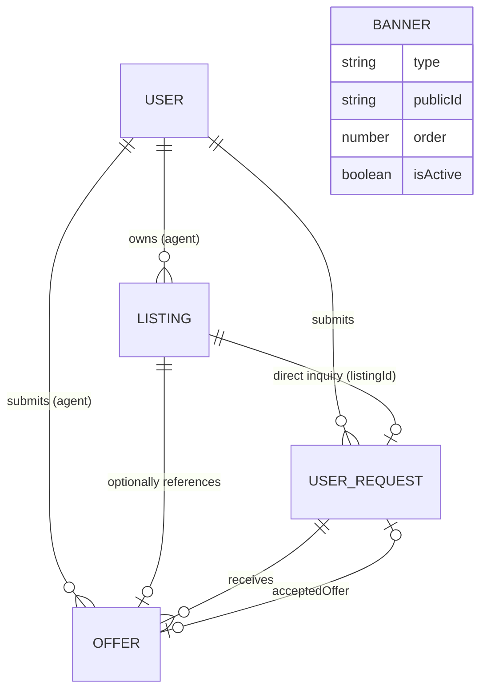
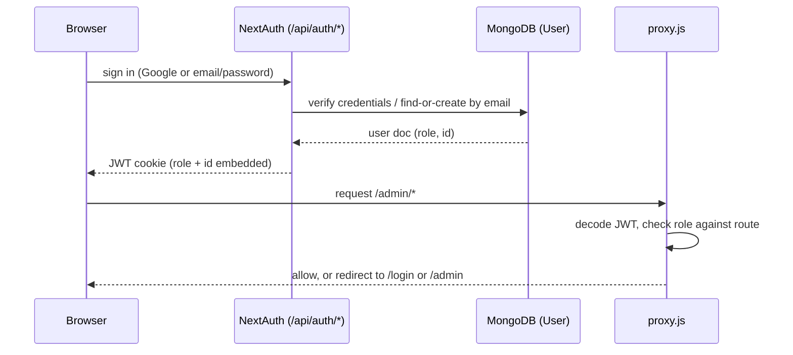
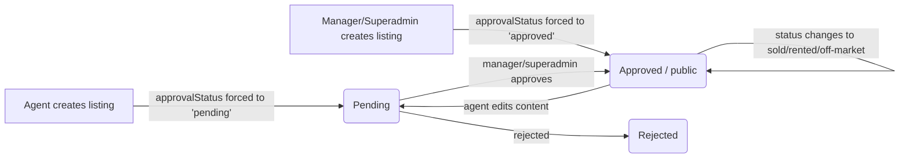
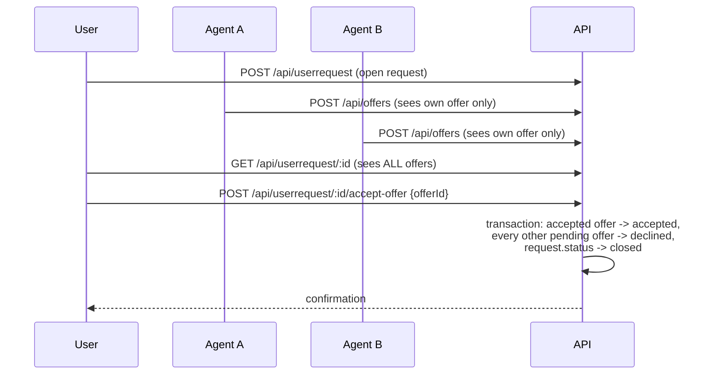
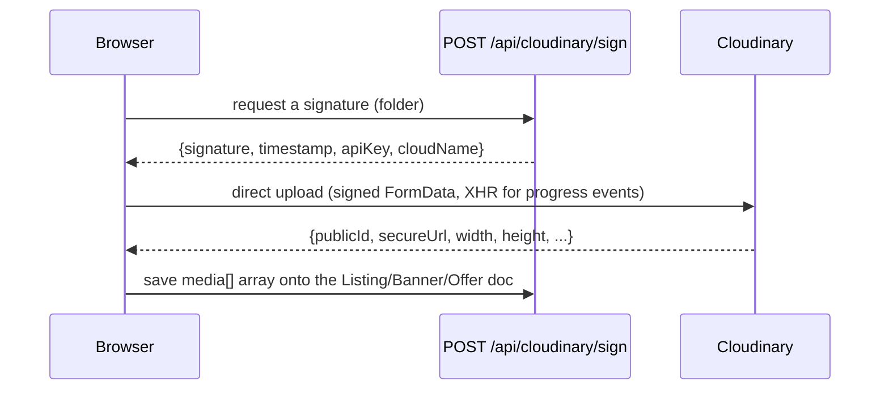

# Richlux Properties

Real-estate lead-gen and listings app for Richlux Property — house sales, property management, shortlet, rentals, and land sales across Lagos and Ibadan. Built on Next.js 16 (App Router), MongoDB/Mongoose, NextAuth, and Cloudinary.

At its core, the app is two things bolted together:

1. **A public listings storefront** — browse/filter/view listings, with an admin-moderated publish workflow.
2. **A sealed-bid request marketplace** — a visitor describes what they're looking for (a "request"), agents privately submit competing offers against it, and the requester picks a winner without seeing rival bids.

## Tech stack

| Layer | Choice |
|---|---|
| Framework | Next.js 16 (App Router), React 18 |
| Database | MongoDB via Mongoose 7 |
| Auth | NextAuth (JWT sessions) — Google OAuth + email/password credentials |
| Media | Cloudinary (direct signed browser uploads, server-side SDK for deletes) |
| Styling | Tailwind CSS, a shared `design-tokens.js` source of truth also feeding MUI |
| UI kit | Custom `components/ui/*` primitives, MUI (`@mui/material`) for admin data tables, Framer Motion for animation |
| Location data | `naija-state-local-government` + `geo-ng` (Nigeria state/LGA/area pickers), reconciled with local overrides in `constants/ibadanAreas.js` |
| Perf/quality tooling | Lighthouse CLI (`npm run lighthouse`) |

## Getting started

```bash
npm install
npm run dev
```

Open [http://localhost:3000](http://localhost:3000).

For a production-accurate check (real minification, no dev-mode overhead) build and start instead:

```bash
npm run build
npm run start
```

## Environment variables

Create a `.env.local` in the project root:

```bash
# MongoDB
MONGODB_URI=

# NextAuth
NEXTAUTH_SECRET=
NEXTAUTH_URL=http://localhost:3000
GOOGLE_ID=
GOOGLE_CLIENT_SECRET=

# Credentials-provider password hashing (bcrypt salt rounds)
SALT=10

# Cloudinary (media storage/optimization for listing images, video, and banners)
CLOUDINARY_CLOUD_NAME=
CLOUDINARY_API_KEY=
CLOUDINARY_API_SECRET=
NEXT_PUBLIC_CLOUDINARY_CLOUD_NAME=

# Present in some environments but currently unread by any code path —
# upload folders are hardcoded per-caller instead (e.g. "richlux/listings").
# CLOUDINARY_BASE_FOLDER=

# Optional — real production domain for SEO (Open Graph/canonical URLs,
# robots.txt, sitemap.xml). Falls back to NEXTAUTH_URL, then localhost.
NEXT_PUBLIC_SITE_URL=
```

`NEXT_PUBLIC_CLOUDINARY_CLOUD_NAME` intentionally duplicates `CLOUDINARY_CLOUD_NAME` — the `NEXT_PUBLIC_` copy is what's exposed to the browser for client-side upload widgets; the unprefixed vars stay server-only.

## First-time setup: creating a Super Admin

There is no self-service way to become an admin — by design, promotion only happens via a CLI script. After registering a normal account (via `/register` or Google sign-in):

1. Run the role backfill once against your database (safe to run anytime; only touches accounts missing a `role`):
   ```bash
   node -r dotenv/config scripts/backfillUserRoles.js dotenv_config_path=.env.local
   ```
2. Promote your account to Super Admin:
   ```bash
   node -r dotenv/config scripts/promoteSuperAdmin.js dotenv_config_path=.env.local you@example.com
   ```

From there, the Super Admin manages other users' roles from `/admin/users`.

Optionally, seed sample listings for local development (requires at least one agent/manager/superadmin account to exist already — run `promoteSuperAdmin.js` first):

```bash
node --env-file=.env.local scripts/seedListings.js
```

This creates ~20 sample listings spanning every category/state/price range, with real photos re-uploaded to Cloudinary, so the `/listings` filter panel has something to actually filter.

## Roles & permissions

| Role | Can do |
|---|---|
| **user** (default) | Register, sign in, submit requests (`/request`), track their own requests and offers (`/my-requests`), apply to become an agent (`/become-agent`). |
| **agent** | Everything a user can, plus: create/edit their own listings (start `pending` until approved), respond to **rental-only** open requests with offers, manage their own `/admin` dashboard. Never sees other agents' offers on the same request (sealed-bid). |
| **manager** | Oversight over all listings/requests/offers across every category, approve/reject agent listings and agent applications, manage the homepage banner carousel, moderate direct listing enquiries. Cannot manage user roles. |
| **superadmin** | Everything a manager can, plus user/role management (`/admin/users`) and reviewing agent applications (`/admin/agent-applications`). The middleware (`proxy.js`) specifically reserves `/admin/users` for this role. There must always be at least one superadmin — the API blocks a superadmin from demoting themselves if they're the last one. |

Role is embedded in the session JWT at login and does **not** update live — a role change made by a superadmin only takes effect the next time that user's token refreshes (re-login, or the 30-day `maxAge` expiry). `Header.jsx` works around this for the one field that changes often (`agentApplication` status) by fetching it fresh via `/api/agent-applications` instead of trusting the token.

## Project structure

```
app/                    # Next.js App Router — pages + API routes
  page.js               # Homepage (server component, fetches banners for LCP)
  listings/              # Public browse + listing detail
  login/, register/, logininterface/   # Auth pages
  become-agent/          # Agent application flow for logged-in users
  request/               # Full-page "Make a Request" wizard
  my-requests/            # A user's own requests + offers received
  admin/                 # Role-gated back office (see below)
  api/                   # Route handlers — see "API reference" below
  robots.js, sitemap.js  # Dynamic SEO metadata
components/
  ui/                    # Design-system primitives (Button, Card, Badge, DataTable, ...)
  admin/                 # Admin-only building blocks (forms, uploaders, Sidebar)
  *.jsx                  # Page-section components (Header, Footer, Hero, ListingsBrowser, ...)
model/                   # Mongoose schemas: User, Listing, Offer, UserRequest, Banner
constants/               # Shared enums (listing.js, request.js) + Nigeria location data
utils/                   # Server infra (database.js, cloudinary.js) and RBAC (auth.js, authOptions.js)
lib/                     # ThemeContext (light/dark mode), muiTheme.js (MUI bridge)
scripts/                 # One-off Node scripts (seeding, role backfill, superadmin promotion)
design-tokens.js         # Single source of truth for colors, consumed by Tailwind AND MUI
tailwind.config.js       # Reads design-tokens.js; also defines the elevation/radius/easing scale
proxy.js                 # Next.js 16's route-middleware convention — gates /admin/* by role
```

### `/admin` route tree

| Route | Who | Purpose |
|---|---|---|
| `/admin` | all staff | Role-aware dashboard (stat cards vary by role) |
| `/admin/listings` | all staff | Listings table — agents see only their own |
| `/admin/listings/new`, `/admin/listings/[id]/edit` | staff w/ edit rights | Create/edit a listing |
| `/admin/requests`, `/admin/requests/[id]` | all staff | The open marketplace of user requests; respond with an offer |
| `/admin/enquiries` | manager/superadmin | Direct single-listing inquiries (has a `listingId`), separate from the open marketplace |
| `/admin/banners` | manager/superadmin | Homepage Hero carousel content |
| `/admin/agent-applications` | superadmin | Approve/reject pending agent applications |
| `/admin/users` | superadmin | User list, role/active toggles |

`app/admin/layout.js` redirects to `/login` server-side unless the session role is `agent`/`manager`/`superadmin`; `components/admin/Sidebar.jsx`'s nav items are drawn from a role→nav-items map, so a role simply never sees links to pages it can't use. `proxy.js` (see "Route protection" below) is the earliest checkpoint, ahead of both of these.

## Data models



- **`User`** — `email`, `username`, `password` (bcrypt hash; absent for Google-only accounts), `image`, `phone`, `role` (`user`/`agent`/`manager`/`superadmin`), `isActive`, `agentApplication: { status, message, appliedAt }`. Registered under the lowercase model name `"user"` — every `ref` in other models points to `"user"`, not `"User"`.
- **`Listing`** — `title`, `description`, `category` (`house-sale`/`property-management`/`shortlet`/`rental`/`land-sale`), `price`, `priceFrequency`, `location {address, city, state}`, `bedrooms`, `bathrooms`, `landSize`, `amenities[]`, `media[]` (`{type, publicId, secureUrl, width, height, duration, isCover}`), `status` (`available`/`pending`/`sold`/`rented`/`off-market`), `approvalStatus` (`pending`/`approved`/`rejected` — a moderation gate **orthogonal** to `status`), `agent` (ref `user`), `isFeatured`, `views`.
- **`Offer`** — an agent's bid against a `UserRequest`: `request` (ref, model name `"UserRequests"`), `agent` (ref `user`), `listing` (optional ref), `title`/`description`/`price`/`priceFrequency`, `location`, `bedrooms`/`bathrooms`, `media[]`, `status` (`pending`/`accepted`/`declined`/`withdrawn`). A unique compound index on `{request, agent}` enforces one offer per agent per request.
- **`UserRequest`** — registered as `"UserRequests"` (plural, capitalized — the one model name that doesn't match the file/variable convention). Holds every field the request wizard can collect: contact info + preferences, `category`, residential fields (bed/bath/furnishing/parking/amenities), category-specific fields (shortlet check-in/out + guest count, rental lease duration, property-management occupancy/service type, land-sale size/title-document/purpose), budget, `moveInTimeframe`, `presentlocation`, `preferredLocations[]`, free-text `request`, optional `listingId` (present only for direct listing inquiries, absent for open marketplace requests), `status` (`open`/`closed`), `acceptedOffer` (ref `Offer`).
- **`Banner`** — homepage Hero carousel slides: `type` (`image`/`video`), `publicId`/`secureUrl`, `order` (display sequence), `isActive` (lets staff stage or retire a slide without deleting the Cloudinary asset). No relationships to other models.

## Data flow

### 1. Auth → role → route access



Three independent layers enforce this, deliberately redundant:
1. **`proxy.js`** (Edge middleware, matches `/admin/:path*` only) — earliest checkpoint, redirects before the page even renders.
2. **`app/admin/layout.js`** — server-side redirect if role isn't staff.
3. **`requireRole()`** (`utils/auth.js`) — every API route handler checks independently, since API routes are never covered by the page-only middleware.

### 2. Listing lifecycle (create → moderate → public)



`approvalStatus` is a moderation gate orthogonal to `status` (the sale/rental state). Public visitors and unauthenticated API calls only ever see `status: "available", approvalStatus: "approved"` — enforced server-side in `GET /api/listing` regardless of what query params are passed (defense-in-depth against a client trying to request pending/rejected listings). If a non-oversight agent edits an already-approved listing's content, `approvalStatus` automatically resets to `"pending"` to force re-review. `isFeatured` listings sort first in the default view (`{isFeatured: -1, createdAt: -1}`) and get a gold "Featured" badge on `ListingItem`.

### 3. The sealed-bid request/offer marketplace

This is the app's most distinctive data flow. A visitor's "request" (submitted via the 5-step `RequestWizardModal`) becomes an open lead that **rental-category** agents can respond to with private offers:



Key rules (all enforced in `utils/auth.js`'s `offerVisibilityFilter` and the API routes):
- Only requests with `category: "rental"` and no `listingId` are open to agent offers (`listingId` present means it's a *direct inquiry* about one specific listing, not an open marketplace lead).
- An agent's `GET` on a request only returns **their own** offer plus a `sealedOffersCount` (how many others exist, without revealing content) — never rival offers.
- The requester and oversight staff (manager/superadmin) see every offer.
- Accepting an offer (`POST /api/userrequest/:id/accept-offer`) is strictly requester-only — it deliberately does not use the staff-oversight bypass every other request-management action gets — and runs inside a MongoDB transaction so "accept one, decline the rest, close the request" happens atomically.
- One offer per agent per request is enforced at the database level (a unique compound index), not just in application code.

### 4. Media upload (listing photos, banners)

The Next.js server never proxies upload bytes — it only signs the request:



This avoids Next.js request body-size and serverless function timeout limits for large images/video. `utils/cloudinaryUpload.js` is the client-side helper; `utils/cloudinary.js` is the separate server-side SDK singleton used only for **deleting** assets (when a listing/banner is deleted or a banner's media is replaced) — uploads and deletes go through two entirely different code paths.

### 5. Homepage banner carousel (LCP-optimized)

`app/page.js` fetches active banners **server-side** (directly via Mongoose, not a client fetch to `/api/banners`) and passes them into `Hero.jsx` as `initialBanners`, used as SWR's `fallbackData`. This means the largest-contentful-paint image is present in the server-rendered HTML immediately, instead of waiting for JS to hydrate and a client-side round-trip to resolve — SWR still revalidates against `/api/banners` in the background afterward to pick up admin changes live.

## API reference

All routes live under `app/api/`. Every handler calls `connectToDB()` first and gates access via `requireRole(allowedRoles)` (throws 401/403) or the non-throwing `getCurrentSession()`.

| Route | Methods | Auth | Purpose |
|---|---|---|---|
| `/api/auth/[...nextauth]` | GET, POST | — | NextAuth catch-all (Google + Credentials) |
| `/api/register` | POST | public | Self-registration (always creates `role: "user"`; optional `applyAsAgent`) |
| `/api/users` | GET | superadmin | List all users |
| `/api/users/[id]` | PATCH | superadmin | Update role/isActive/agentApplicationStatus |
| `/api/agent-applications` | GET, POST | any user | View own status / apply to become an agent |
| `/api/listing` | GET, POST | public (GET), staff (POST) | Search/filter listings; create a listing |
| `/api/listing/[id]` | GET, PATCH, DELETE | public (GET), owner/staff (write) | View (increments `views`), edit, delete (+ Cloudinary cleanup) |
| `/api/offers` | POST | agent, manager | Submit an offer against an open rental request |
| `/api/offers/[id]` | PATCH | owner or oversight | Edit/withdraw own offer, or oversight can decline |
| `/api/userrequest` | GET, POST | staff (GET), any user (POST) | List requests (staff); submit a new request (anyone) |
| `/api/userrequest/[id]` | GET, PATCH | owner/staff | View with sealed-bid-filtered offers; staff update status |
| `/api/userrequest/mine` | GET | any user | Caller's own requests + offer counts |
| `/api/userrequest/[id]/accept-offer` | POST | requester only | Atomically accept one offer, decline the rest |
| `/api/banners` | GET, POST | public (GET), manager/superadmin (POST) | Homepage carousel content |
| `/api/banners/[id]` | PATCH, DELETE | manager/superadmin | Reorder/toggle/delete a banner |
| `/api/cloudinary/sign` | POST | staff | Signed direct-upload credentials |

## Component architecture

- **Page sections** (`components/*.jsx`) — `Header` (nav + auth-aware menu), `Footer`, `Richlux` (homepage hero/CTA), `Hero` (banner carousel + video), `Listings`/`ListingsBrowser` (the shared filter/browse engine used by both the homepage and `/listings`), `ListingItem` (a single listing card), `RequestWizardModal` (the 5-step request form — the largest component in the app), `OfferCard`, `ListingInquiryButton`.
- **`components/ui/`** — design-system primitives: `Button`, `Card`, `Badge`/`FeaturedBadge`, `Container`, `DataTable`, `MediaGallery`, `ConfirmDialog`, `AuthLayout`, `ThemeToggle`, skeleton/loading components.
- **`components/admin/`** — `Sidebar` (role-conditional nav), `ListingForm`, `MediaUploader`, `OfferForm`/`OfferFormModal`, `BannerManager`.
- **`Provider.jsx`** — the root client provider stack: `SessionProvider` (NextAuth) → `ThemeModeProvider` → a MUI `ThemeProvider` bridge that feeds the app's own light/dark state into `getMuiTheme()`, so custom Tailwind theming and MUI's admin tables never visually drift apart.

## Theming

Light/dark mode is controlled by a single `localStorage` key (`richlux-theme`):
- An inline script in `app/layout.js`'s `<head>` sets the `dark` class on `<html>` **before** hydration (reading `localStorage`, falling back to `prefers-color-scheme`) to avoid a flash of the wrong theme.
- `lib/ThemeContext.jsx`'s `ThemeModeProvider` brings React state into agreement with that class after mount, and `toggleTheme()` flips it and persists the choice.
- `design-tokens.js` is the single source of truth for every color (`brand`, `ink`, `surface`, `gold`, status colors), consumed by both `tailwind.config.js` (`require`) and `lib/muiTheme.js` (`import`) — so Tailwind and MUI never drift onto different palettes.
- `tailwind.config.js` also documents the app's de facto elevation (`boxShadow.elevation-sm/md/lg`), border-radius tiering, and a shared easing curve (`ease-luxury`) for hover/lift micro-interactions.

## Route protection (`proxy.js`)

Next.js 16 renamed the root `middleware.js` convention to `proxy.js` — this file is auto-detected by filename, no wiring required in `next.config.js`. Scoped to `/admin/:path*` only (API routes are protected separately by `requireRole()`, since redirecting an API caller to `/login` instead of returning a JSON 401 would break API clients). Redirects unauthenticated visitors to `/login`, non-staff roles away from `/admin`, and non-superadmins away from `/admin/users` specifically.

## Scripts

| Script | Purpose |
|---|---|
| `npm run dev` / `build` / `start` | Standard Next.js dev/build/serve |
| `npm run lint` | ESLint |
| `npm run lighthouse` | Runs Lighthouse against `localhost:3000`, writes JSON+HTML reports to `.lighthouse/` (gitignored) — **run against a production build (`npm run build && npm run start`) for meaningful performance numbers**; dev mode's unminified/unbundled JS gives misleadingly low scores |
| `scripts/backfillUserRoles.js` | One-time migration: sets `role`/`isActive` defaults on `User` docs predating the RBAC system |
| `scripts/promoteSuperAdmin.js <email>` | The only way to mint the first Super Admin |
| `scripts/seedListings.js` | Dev-only: seeds ~20 sample listings with real Cloudinary-hosted photos across every category/state/price range |

## Notes for future contributors

- **Model naming is inconsistent** — `User` registers as `"user"` (lowercase), `UserRequest` registers as `"UserRequests"` (plural), `Listing`/`Offer`/`Banner` use their capitalized singular names. Match whatever the existing model actually registered as when adding a new `ref`, not what seems consistent.
- **Two separate Cloudinary paths**: uploads go browser-direct (signed request + XHR), deletes go through the server SDK (`utils/cloudinary.js`) — there is no code path where the Next.js server receives upload bytes.
- **The rental marketplace is category-scoped**: agents only ever see/respond to `category: "rental"` requests without a `listingId`; everything else (direct inquiries, other categories) skips the offer system entirely.
- **JWT role staleness**: a role change takes effect on next login, not immediately — anywhere in the UI that needs to reflect a fast-changing field (like `agentApplication.status`), fetch it live instead of trusting `session.user`.
